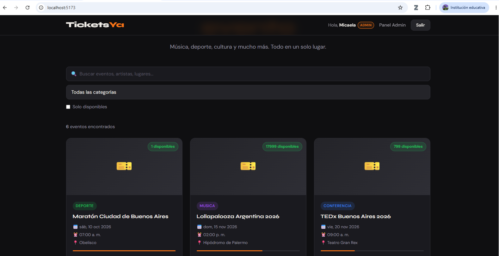
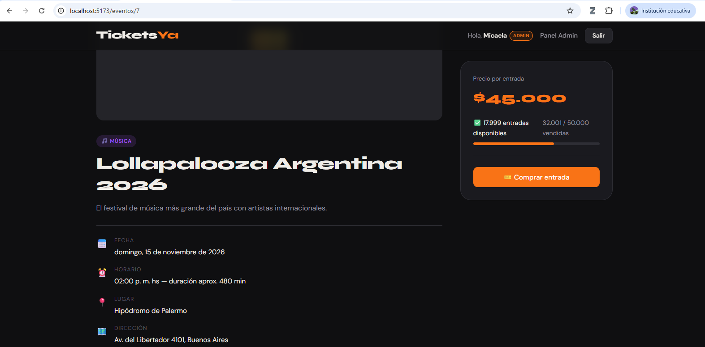
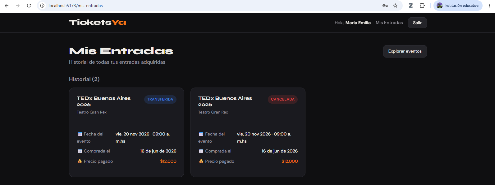
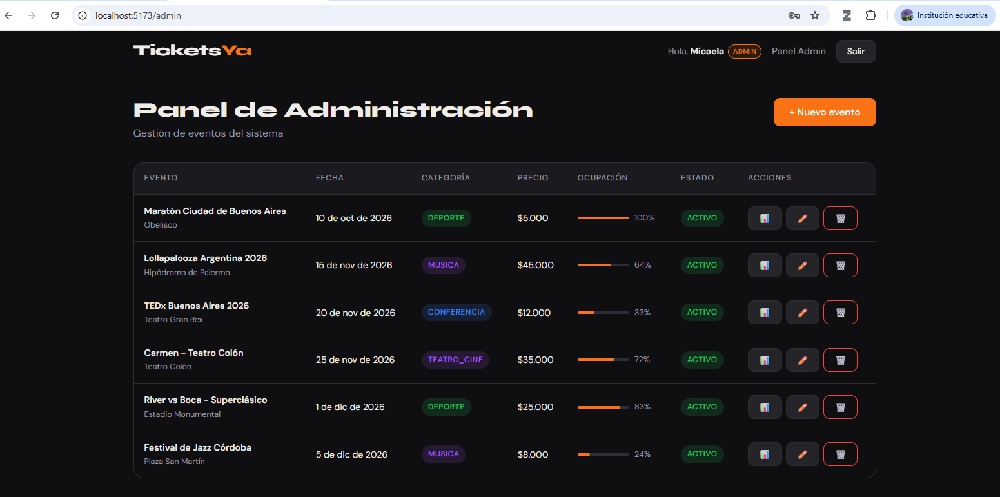
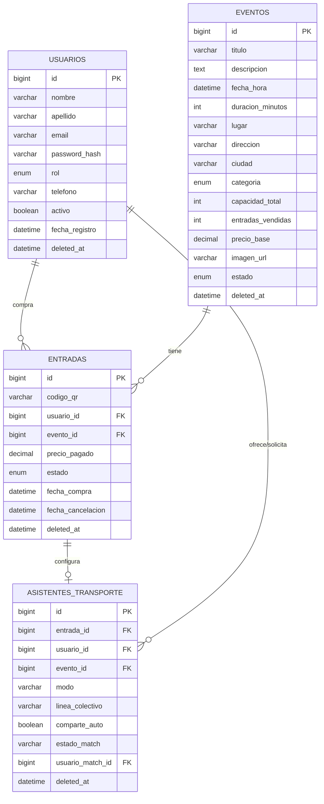

# 🎫 SistemaTickets

> Plataforma de venta de entradas para eventos, con catálogo público, compra y gestión de tickets para clientes, panel de administración para organizadores, y un asistente de transporte que ayuda a los asistentes a planear cómo llegar al evento (colectivo, auto propio, o compartir auto con otro asistente).

---

## Tabla de contenidos

- [Capturas de pantalla](#capturas-de-pantalla)
- [Tecnologías](#tecnologías)
- [Requisitos previos](#requisitos-previos)
- [Instalación y uso](#instalación-y-uso)
  - [Opción A — Docker (recomendada)](#opción-a--con-docker-recomendada)
  - [Opción B — Manual](#opción-b--instalación-manual)
- [Ejecutar los tests](#ejecutar-los-tests)
- [Diagrama de base de datos](#diagrama-de-base-de-datos)
- [Endpoints de la API](#endpoints-de-la-api)
- [Funcionalidad bonus: Asistente de transporte](#funcionalidad-bonus-asistente-de-transporte)
- [Estructura del proyecto](#estructura-del-proyecto)
- [Decisiones de diseño](#decisiones-de-diseño)

---

## Capturas de pantalla

| Catálogo | Detalle del evento |
|---|---|
|  |  |

| Mis Entradas | Panel de Administración |
|---|---|
|  |  |

---

## Tecnologías

**Backend:** Go 1.21 · Gin · GORM · MySQL · JWT · bcrypt · testify
**Frontend:** React 18 · Vite · React Router v6 · Axios
**DevOps:** Docker · Docker Compose

---

## Requisitos previos

### Si usás Docker (recomendado)
- [Docker Desktop](https://www.docker.com/products/docker-desktop/)

### Si instalás todo manualmente
- [Go](https://go.dev/dl/) 1.21+
- [Node.js](https://nodejs.org/) 20+
- [MySQL](https://dev.mysql.com/downloads/) 8.0+

---

## Instalación y uso

### Opción A — Con Docker (recomendada)

Levanta los 3 componentes (MySQL, backend y frontend) con un solo comando, sin necesidad de instalar Go, Node o MySQL en tu máquina.

```bash
# 1. Crear un archivo .env en la raíz del proyecto (junto a docker-compose.yml)
echo "DB_PASSWORD=tickets123" > .env
echo "DB_NAME=sistematickets" >> .env
echo "JWT_SECRET=elmejorproyectodedesarrollodesoft" >> .env

# 2. Levantar todo
docker compose up --build

# 3. Cargar datos de prueba (en otra terminal, con todo arriba)
node seed.js
```

- Frontend: **http://localhost:5173**
- Backend: **http://localhost:8080**
- MySQL expuesto en el puerto **3306** del host (por si querés conectarte con un cliente MySQL)

Para apagar todo:
```bash
docker compose down            # conserva los datos (volúmenes)
docker compose down -v         # borra también los datos de la base
```

---

### Opción B — Instalación manual

#### 1. Base de datos

```sql
CREATE DATABASE sistematickets CHARACTER SET utf8mb4 COLLATE utf8mb4_unicode_ci;
```

#### 2. Backend

```bash
cd backend

# Configurar variables de entorno
cp .env.example .env
# Editar .env con tus datos de MySQL

# Descargar dependencias
go mod download

# Ejecutar servidor (crea las tablas automáticamente)
go run main.go

# Servidor en: http://localhost:8080
```

#### 3. Cargar datos de prueba

```bash
npm install mysql2
node seed.js
```

#### 4. Frontend

```bash
cd frontend

# Instalar dependencias
npm install

# Iniciar servidor de desarrollo
npm run dev

# Frontend en: http://localhost:5173
```

---

## Ejecutar los tests

```bash
cd backend

# Correr todos los tests
go test ./...

# Con detalle (muestra cada test individual)
go test -v ./...

# Ver cobertura por paquete
go test ./... -cover

# Ver cobertura función por función
go test ./... -coverprofile=coverage.out
go tool cover -func=coverage.out

# Generar reporte HTML navegable
go tool cover -html=coverage.out -o coverage.html
```

Cobertura actual: **services ~83%** y **controllers ~82%**, superando el objetivo del 80% exigido sobre la capa de lógica de negocio y controladores.

---

## Diagrama de base de datos

El esquema completo (entidades, atributos y relaciones por clave foránea) está disponible en [`docs/diagrama-db.mmd`](docs/diagrama-db.mmd) en formato Mermaid.



---

## Endpoints de la API

Base URL: `http://localhost:8080/api/v1`

### Autenticación

| Método | Endpoint | Descripción | Auth |
|---|---|---|---|
| POST | `/auth/registro` | Registrar usuario | No |
| POST | `/auth/login` | Iniciar sesión | No |

### Eventos (cliente)

| Método | Endpoint | Descripción | Auth |
|---|---|---|---|
| GET | `/eventos` | Listar eventos (filtros opcionales) | No |
| GET | `/eventos/:id` | Detalle de un evento | No |

### Eventos (administrador)

| Método | Endpoint | Descripción | Auth |
|---|---|---|---|
| GET | `/admin/eventos` | Listar todos los eventos | JWT + Admin |
| POST | `/admin/eventos` | Crear evento | JWT + Admin |
| PUT | `/admin/eventos/:id` | Actualizar evento | JWT + Admin |
| DELETE | `/admin/eventos/:id` | Eliminar evento (soft-delete) | JWT + Admin |
| GET | `/admin/eventos/:id/reporte` | Reporte de ocupación y compradores | JWT + Admin |
| POST | `/admin/eventos/:id/imagen` | Subir imagen del evento | JWT + Admin |

### Entradas

| Método | Endpoint | Descripción | Auth |
|---|---|---|---|
| POST | `/entradas/comprar` | Comprar una o más entradas | JWT |
| GET | `/entradas/mis-entradas` | Historial de entradas propias | JWT |
| PUT | `/entradas/:id/cancelar` | Cancelar entrada | JWT |
| PUT | `/entradas/:id/transferir` | Transferir entrada a otro usuario | JWT |

### Asistente de transporte (Bonus Track)

| Método | Endpoint | Descripción | Auth |
|---|---|---|---|
| POST | `/transporte` | Configurar transporte de una entrada | JWT |
| GET | `/transporte/entrada/:entradaId` | Consultar configuración de una entrada | JWT |
| GET | `/transporte/ofertas/:eventoId` | Listar ofertas de auto compartido para un evento | JWT |
| POST | `/transporte/:id/solicitar` | Solicitar unirse a un auto compartido | JWT |
| PUT | `/transporte/:id/responder` | Aprobar o rechazar una solicitud | JWT |

**Filtros disponibles en `/eventos`:**
```
?busqueda=rock
?categoria=musica|deporte|cultura|teatro_cine|conferencia|otro
?solo_disponibles=true
```

**Body de compra con varias entradas:**
```json
{ "evento_id": 1, "cantidad": 3 }
```

**Header de autenticación:**
```
Authorization: Bearer <token_jwt>
```

---

## Funcionalidad bonus: Asistente de transporte

Una vez que un usuario compra una entrada, desde **Mis Entradas** puede configurar cómo planea llegar al evento:

- **🚌 Colectivo** — elige una línea de un catálogo predefinido y accede a un link con horarios reales.
- **🚗 Auto propio** — ve estacionamientos cercanos sugeridos, y puede elegir si quiere compartir su auto con otro asistente.
- **🚙 Compartido** — ve la lista de usuarios que ofrecen su auto para el mismo evento y puede solicitar unirse. El dueño del auto recibe la solicitud y puede aprobarla o rechazarla; una vez aprobada, ambos usuarios ven los datos de contacto del otro para coordinar el viaje.

Esta funcionalidad usa una entidad nueva (`AsistenteTransporte`) con relación 1 a 1 con cada entrada, y un sistema de matching con estados `pendiente`, `aprobado` y `rechazado` para coordinar el auto compartido entre dos usuarios.

---

## Estructura del proyecto

```
sistematickets/
├── docker-compose.yml      # Orquesta MySQL + backend + frontend
├── seed.js                 # Carga eventos de prueba (idempotente)
├── backend/
│   ├── Dockerfile
│   ├── clients/            # Conexión MySQL (GORM singleton)
│   ├── controllers/        # Handlers HTTP + Middlewares
│   ├── dao/                # Data Access Objects
│   ├── domain/             # Entidades y DTOs
│   ├── services/           # Lógica de negocio
│   ├── utils/               # JWT, bcrypt, respuestas, QR, límite de body
│   ├── uploads/eventos/     # Imágenes subidas (volumen persistente en Docker)
│   └── main.go
├── frontend/
│   ├── Dockerfile
│   └── src/
│       ├── components/      # Navbar
│       ├── context/         # AuthContext
│       ├── pages/           # Inicio, Detalle, Login, Registro, MisEntradas, Admin
│       └── services/        # api.js (Axios)
└── docs/
    ├── diagrama-db.mmd
    └── screenshots/
```

---

## Decisiones de diseño

**1. bcrypt en lugar de MD5/SHA256**
Bcrypt incluye salt automático y es computacionalmente costoso por diseño, lo que lo hace mucho más seguro para almacenar contraseñas que MD5 o SHA256.

**2. Soft-delete para eventos**
Los eventos eliminados conservan `deleted_at` pero no se borran físicamente. Esto preserva el historial de entradas compradas: si un evento se da de baja, los usuarios siguen viendo sus tickets en "Mis Entradas".

**3. Transferencia crea nueva entrada**
Al transferir, la entrada original queda como "transferida" y se genera una nueva con QR distinto para el destinatario. Garantiza trazabilidad completa de la cadena de titularidad.

**4. Interfaces en DAOs y Servicios**
Todas las capas se definen como interfaces, permitiendo mockear dependencias en tests sin necesitar una base de datos real.

**5. Transacciones atómicas en operaciones críticas**
Comprar, cancelar y transferir entradas envuelven la escritura (crear/actualizar entrada + actualizar contador de ventas del evento) en `db.Transaction()`. Si cualquier paso falla, GORM revierte todo — evita que quede una entrada creada sin que el contador de ventas se actualice, o viceversa.

**6. El estado de matching vive en el registro del dueño del auto, no del solicitante**
En el asistente de transporte, cuando alguien solicita compartir auto, el campo `estado_match` se actualiza en el `AsistenteTransporte` del dueño (no se crea un registro nuevo para el solicitante). Esto simplifica la consulta "¿tengo una solicitud pendiente?" a una sola fila por oferta, en vez de necesitar una tabla intermedia de relación muchos-a-muchos para un caso que en la práctica es 1 a 1 por evento.